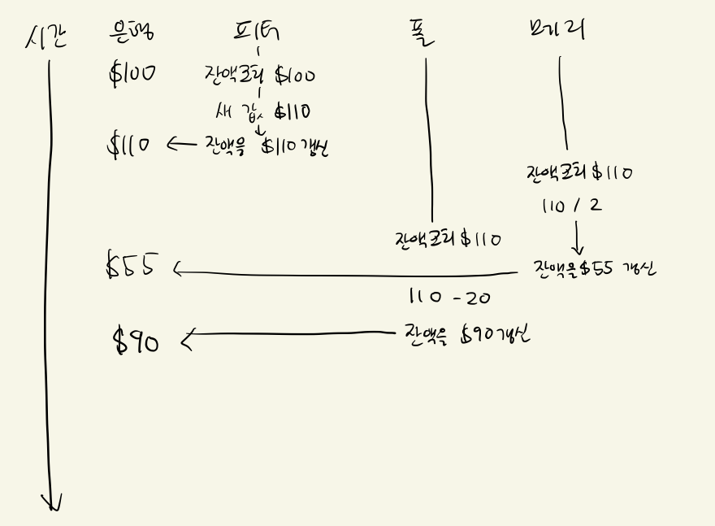

a.

1. 피터 -> 폴 -> 메리 인 경우: 110 -> 90 -> 45
2. 피터 -> 메리 -> 폴 인 경우: 110 -> 55 -> 35
3. 폴 -> 메리 -> 피터 인 경우: 80 -> 40 -> 50
4. 폴 -> 피터 -> 메리 인 경우: 80 -> 60 -> 30
5. 메리 -> 폴 -> 피터 인 경우: 50 -> 30 -> 40
6. 메리 -> 피터 -> 폴 인 경우: 50 -> 60 -> 40

b.

